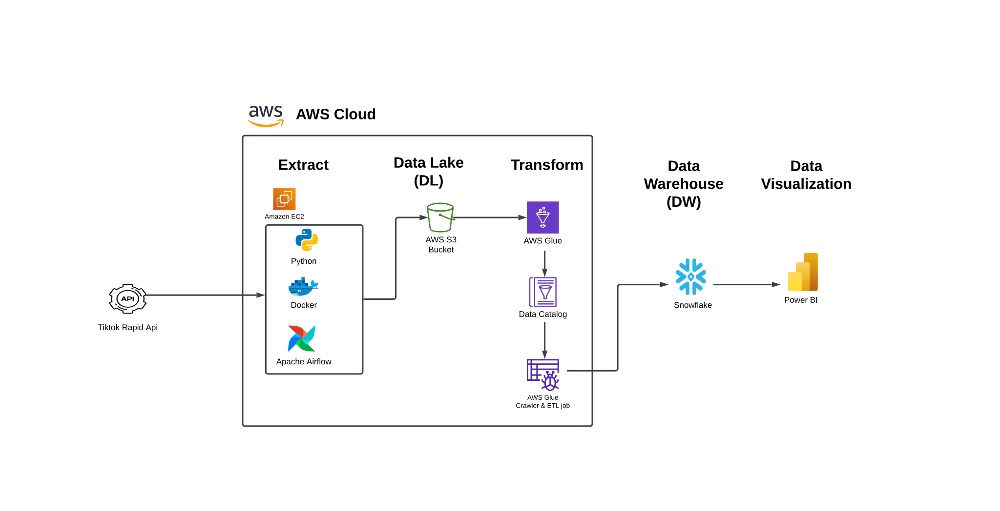

# TikTok Insights Pipeline

## **Project Description**
This project analyzes TikTok User Data  using AWS services such as EC2, S3, Glue, and Snowflake. The goal is to extract, transform, and load (ETL) the data into Snowflake for business insights and visualizations using Power BI.


## **Table of Contents**
- [TikTok Insights Pipeline](#tiktok-insights-pipeline)
  - [**Project Description**](#project-description)
  - [**Table of Contents**](#table-of-contents)
  - [**Features**](#features)
  - [**Tech Stack**](#tech-stack)
  - [**Data Workflow**](#data-workflow)
  - [**Setup Guide**](#setup-guide)
    - [Step 1: Create an EC2 Machine to Extract Data from an API](#step-1-create-an-ec2-machine-to-extract-data-from-an-api)
    - [Step 2: Set Up S3 Bucket](#step-2-set-up-s3-bucket)
    - [Step 3: Create a Database in AWS Glue \& Set Up Glue Permissions for accessing S3 Bucket](#step-3-create-a-database-in-aws-glue--set-up-glue-permissions-for-accessing-s3-bucket)
    - [Step 4: Create a Table using AWS Glue Crawlers](#step-4-create-a-table-using-aws-glue-crawlers)
    - [Step 5: Set up Snowflake Connection on AWS Glue](#step-5-set-up-snowflake-connection-on-aws-glue)
    - [Step 6: Create and Run an ETL Job in AWS Glue](#step-6-create-and-run-an-etl-job-in-aws-glue)
    - [Step 7:  Validate Transformed data in Snowflake](#step-7--validate-transformed-data-in-snowflake)
    - [Step 8: Integrate Snowflake with Power BI to Analyze Business Insights](#step-8-integrate-snowflake-with-power-bi-to-analyze-business-insights)
  - [**Conclusion**](#conclusion)

---
## **Features**
- Extracts data from an API using an EC2 instance.
- Stores raw data in an S3 bucket.
- Uses AWS Glue for data transformation and ETL processes.
- Loads processed data into Snowflake for analysis.
- Creates insightful visualizations using Power BI.

## **Tech Stack**
- **Cloud Services**: AWS EC2, S3, Glue, Snowflake
- **Programming Language**: Python
- **ETL Tools**: Apache Airflow, AWS Glue
- **Data WareHouse**: Snowflake
- **Visualization**: Power BI

## **Data Workflow**
1. Extract data from the API using EC2.
2. Store raw data in an S3 bucket.
3. Use AWS Glue to clean and transform the data.
4. Load the transformed data into Snowflake.
5. Create a Power BI dashboard for business insights.

---
## **Setup Guide**

### Step 1: Create an EC2 Machine to Extract Data from an API
1. Log in to the AWS Management Console.
2. Navigate to **EC2** and launch a new Ubuntu instance.
   
3. Connect to the EC2 instance:
   
4. Install necessary packages:
   ```bash
   sudo apt-get update
   sudo apt install python3-pip docker.io docker-compose
   sudo pip install pandas requests boto3
   ```
5. Set up Airflow directories:
   ```bash
   mkdir -p airflow/dags airflow/logs airflow/plugins
   ```
6. Create and edit `docker-compose.yaml`:
   ```bash
   touch airflow/docker-compose.yaml
   vim airflow/docker-compose.yaml
   ```
   Add the code of  `airflow/docker-compose.yaml`  
7. Add and configure the DAGs in `airflow/dags/tiktok_api.py`.
8. Before Starting the DAG,You must  Add your AWS access key, AWS secret key, AWS Region name and AWS Bucket name in your DAG Code. 
   Note: Create your AWS Access key &  AWS Secret Key in AWS Console.
9.  Start Airflow:
   ```bash
   cd airflow
   sudo docker-compose up
   ```
10. Access the Airflow UI at `<EC2_IP>:8080`.
   - Username: airflow
   - Password: airflow
11. Activating the DAG
   - In the Airflow UI, navigate to the DAGs tab.
   - Locate fetch_data_from_earth_quake_api.
   
   - Toggle it On to activate.
Steps Executed by the DAG:
Fetch tiktok  data from the API.
convert into csv file
uploading csv file into S3 Bucket.


### Step 2: Set Up S3 Bucket
1. Navigate to **S3** in AWS Management Console.
2. Create a new bucket named `project-with-tiktok-data`.
   
3. Once the Pipeline run successfully on Airflow UI, Automatically csv file will upload into the S3 Bucket
   
   


### Step 3: Create a Database in AWS Glue & Set Up Glue Permissions for accessing S3 Bucket
1. Assign **GlueFullAccess** IAM role permission in IAM Service.
2. Go to AWS Glue Console  and create a database named `tiktok`.   
   

### Step 4: Create a Table using AWS Glue Crawlers
1. Go to AWS Glue console → Crawlers → Add Crawler.
   
2. Configure the crawler to point to the S3 bucket.
3. Assign the IAM role and output to `tiktok` database.
4. Run the crawler and verify schema creation.

### Step 5: Set up Snowflake Connection on AWS Glue 
1. Navigate to AWS Secrets Manager console → Create Secrets.
2. Create a secret with the following details:
   - Name: "snowflake_credentials
   - Username: snowflake_user_name"
   - Password: snowflake_password
   
   Click on save & create.
3. Open AWS Glue Console → Data Catalog → Connections
4. Click on Add Connection and enter the following details:
   - Name: "snowflake-connection"
   - Connection type: "Snowflake-preview"
   - Snowflake URL: "your_snowflake_server_url"
   - AWS Secret: "snowflake_credentials"
   
   
   click on create connection


### Step 6: Create and Run an ETL Job in AWS Glue
1. Open AWS Glue console → Jobs → Add Job with Visual ETL.
2. Select **S3 bucket** (`project-with-tiktok-data`) as the source.
3. Transform data:
   - Drop unnecessary columns.
   - Remove duplicates.
   - Configure target schema for Snowflake.
4. Select Snowflake as the target and enter Some Snowflake Details .
   - Name: Snowflake
   - Snowflake Connection: "snowflake-connection"
   - Database: "Amazon_DB"
   - Schema: "public"
   - Table: "tiktok_data"
   
5. Configure Job Execution:
   - Specify the following:
     - **Script Configuration**: Verify the auto-generated ETL script.
     - **Job Details**: Review job name, description, and runtime environment.
     - **Worker Nodes**: Select the number of nodes and configure CPU and RAM based on data size.
   - Ensure that the IAM role has sufficient Glue and S3 permissions.


6. Save and Run the Job:
   - Save the job configuration.
   - Click on **Run Job** to start the ETL process.

7. Monitor the Job:
   - Check the status of the ETL job in the Glue console. It may take some time to complete.
   - Once completed, the transformed data will be available in the `Snowflake` 


### Step 7:  Validate Transformed data in Snowflake 
1. Navigate into the snowflake console with login credentials to Verify the Transformed Data.
2. Run the below queries in Snowflake notebook to verify the transformed data.
   ```sql
   USE ROLE ACCOUNTADMIN;
   USE WAREHOUSE COMPUTE_WH;
   USE AMAZON_DB;
   USE SCHEMA Main;
   SELECT * FROM tiktok_data;
   ```
   

### Step 8: Integrate Snowflake with Power BI to Analyze Business Insights
1. Open Power BI → Get Data → Select Snowflake.
   
2. Enter Snowflake **server URL** and **warehouse**.
   
3. Enter **username** and **password** to connect.
4. Load data and create Power BI dashboards.
   

---
## **Conclusion**
This project demonstrates a complete ETL pipeline using AWS services and Snowflake, enabling efficient data analysis and visualization with Power BI. The workflow ensures automated data ingestion, transformation, and insights generation for business decision-making.

